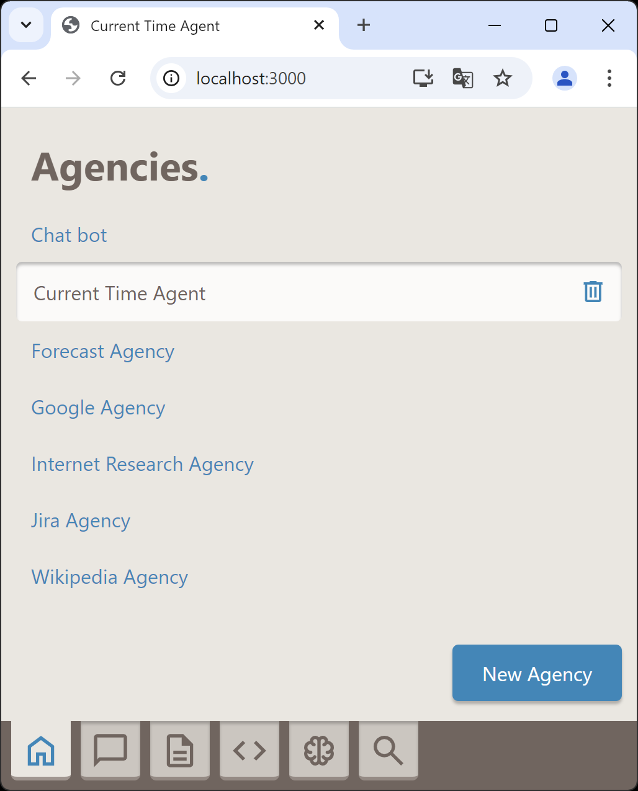
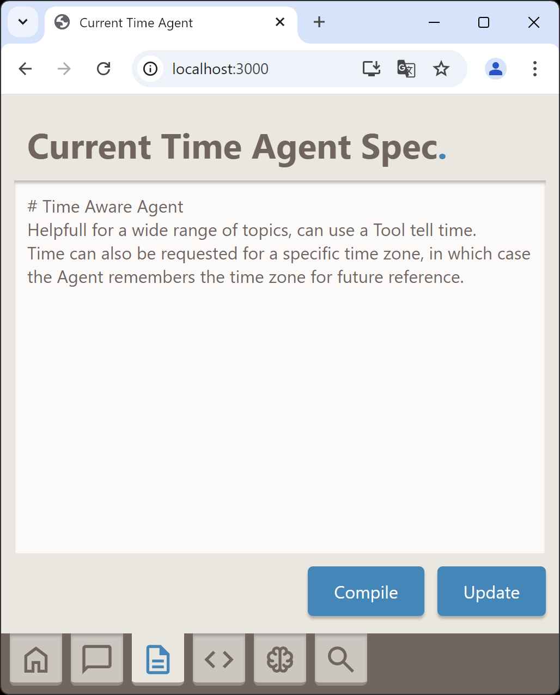
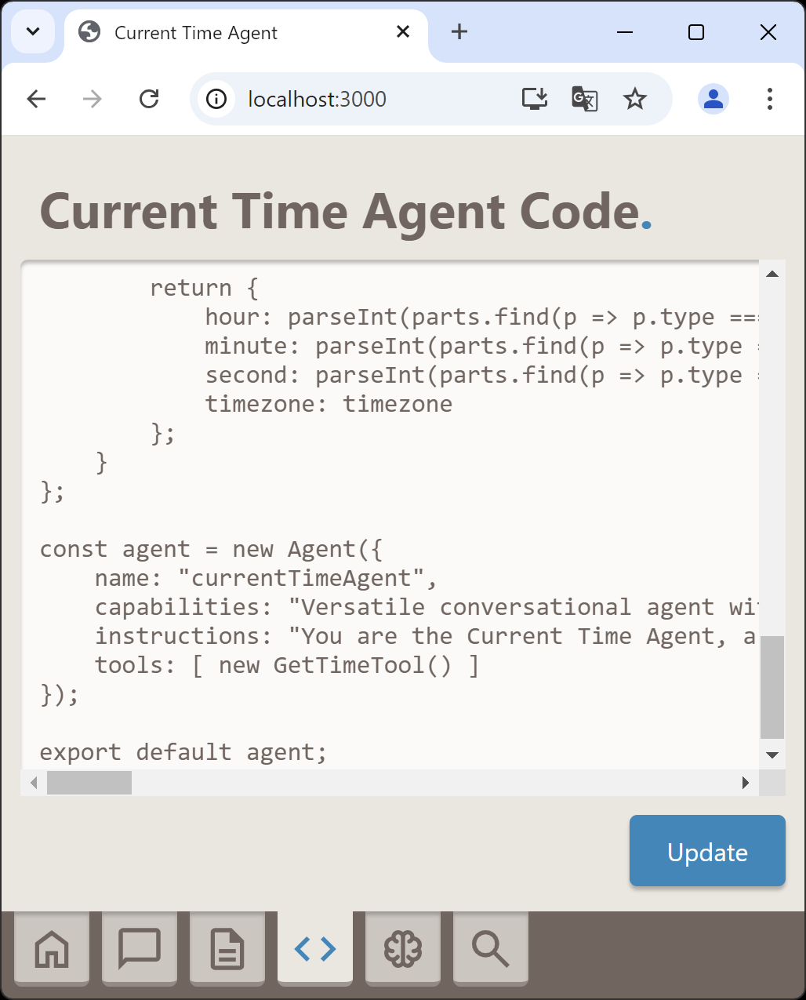
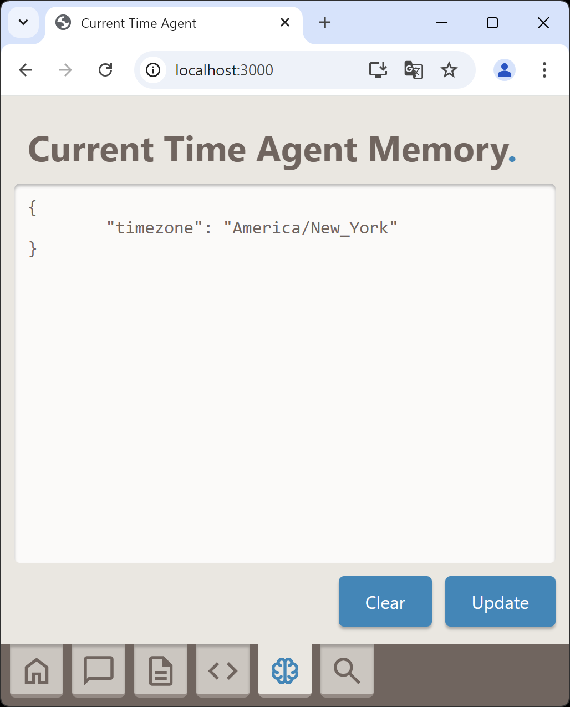
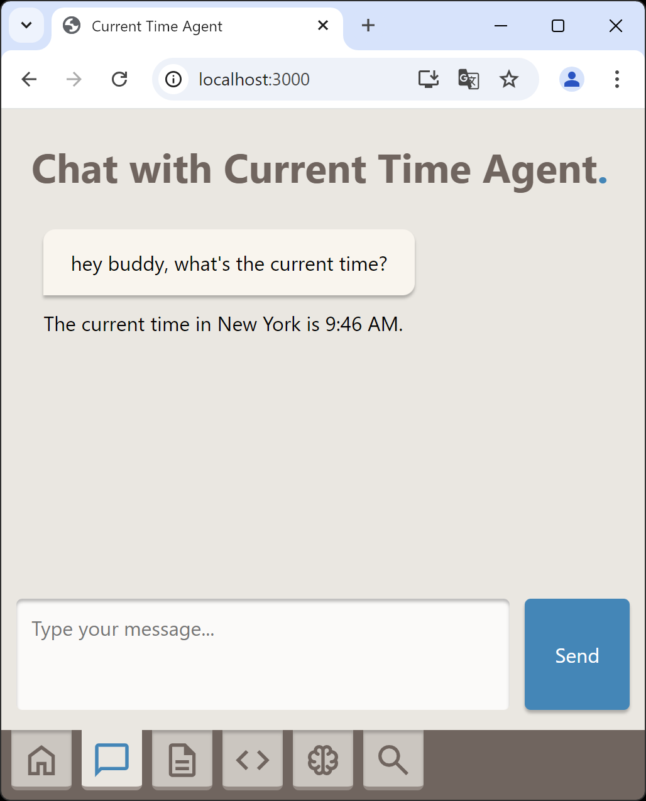

# Agencija

This project is a simple Node.js framework for building and executing Agentic AI solutions using OpenAI's assistants and threads APIs, with special support for compiling human-readable agency specifications into executable Node.js modules.

## Table of Contents

1. [Agencija](#agencija)
   - [Key Features](#key-features)
   - [Simple Example](#simple-example)
   - [Installation](#installation)
2. [Agentic Framework Runtime](#agentic-framework-runtime)
   - [Provider Class](#provider-class)
   - [OpenAiProvider Class](#openai-provider-class)
   - [Entity Class](#entity-class)
   - [Agent Class](#agent-class)
   - [Agency Class](#agency-class)
   - [Memory Class](#memory-class)
   - [Tool Class](#tool-class)
   - [DelegateTool Class](#delegate-tool-class)
   - [MemoryTool Class](#memory-tool-class)
3. [Compiler System](#compiler-system)
   - [Console Class](#console-class)
   - [Compiler Class](#compiler-class)
   - [Compilation Process](#compilation-process)
4. [Runtime Console](#runtime-console)
5. [Server](#server)
   - [Console Class](#console-class-1)
   - [Server Class](#server-class)
   - [Web Class](#web-class)
   - [App Class](#app-class)
6. [API](#api)
   - [Agencies API Domain](#agencies-api-domain)
   - [Chat API Domain](#chat-api-domain)
   - [WebSocket Events](#websocket-events)
7. [Web UI](#web-ui)
    - [Core Components](#core-components)
    - [Tab System](#tab-system)
    - [UI Layout](#ui-layout)

## Key Features

-  **Agentic Framework**: A simple foundation for building and executing AI agents, written in Node.js. Offers a flexible and extensible architecture for building AI agents with event-based obsevability. Can be used independently of the compiler and the rest of features.
-  **Compilation**: A LLM based "compiler" that automatically converts human-readable agency specifications into executable Node.js modules, utilising the Agentic Framework. Fixes compilation bugs automatically. Can be used via the command line interface or the API.
-  **API**: An API providing programmatic access to Agentic Framework runtime and compiler functionalities. Also can pass server-side events to clients using Socket.io, enabling real-time observability on the client side.
-  **Web UI**: A user-friendly browser interface that enables interaction with the runtime and compiler functionalities.

## Installation
Instructions on how to set up the project locally.
```bash
# Clone the repository
git clone https://github.com/borivojekovac/agencija.git

# Navigate into the project directory
cd agencija

# Install dependencies
npm install
```

## Configuration
The server uses config NPM module for managing configuration, and stores configuration files in the [config](config) folder. The [default.json](config/default.json) contains the configuration structure and default values. You can override the default values by creating a new file with the environment or use case name in the same folder, for example development.json.

Here's how the default configuration looks like:

```json
{
    "server": {
        "httpPort": 3000,
        "httpsPort": 3443,
        "httpsKey": "server-192-168-1-20.key",
        "httpsCertificate": "server-192-168-1-20.cert",
        "maxRequestSize": "500kb"
    },
    "llmProviders": {
        "openAi": {
            "apiKey": null
        }
    },
    "log": {
        "folder": "./logs/agencija.log"
    }
}
```

An here's an example of a development configuration:

```json
{
    "llmProviders": {
        "openAi": {
            "apiKey": "your-open-ai-api-key-here"
        }
    }
}
```

To make the server use development configuration, you need to set the `NODE_ENV` environment variable to `development`.

### Simple Example

To build a simple agentic AI solution to fetch and display the current time via Web UI, you'd follow the following steps. First of all, create a new Agency using New Agency button on the home tab. Name it appropriately by clicking on the name and typing in the name you like, for instance Current Time Agent. 



Alternatively, you can just create a txt file in the [agencies](agencies) folder. To rename, you can also rename the file in the agencies folder, but if doing so, make sure to rename other files with the same name as well - e.g. Current Time Agent.txt, Current Time Agent.js, Current Time Agent.mem...

Switching to the spec tab, you can see the contents of the file, and you can write down a human-readable agency specification yourself, like so:

**Current Time Agent.txt**

```text
# Time Aware Agent
Helpfull for a wide range of topics, can use a Tool tell time.
Time can also be requested for a specific time zone, in which case the Agent remembers the time zone for future reference.
```



You would then use compiler to turn this into executable Node.js module either by running a command-line command or using "Compile" button on the Spec Tab.

```bash
node compiler/console.js "agency=Current Time Agent"
```

The compiler would produce a code in [agencies](agencies) folder similar to this:

**Current Time Agent.js**

```js
import Agent from "../runtime/agent.js";
import Tool from "../runtime/tool.js";

class GetTimeTool extends Tool {

    constructor() {

        super({
            name: "getTimeTool",
            args: {
                timezone: false // not required
            }
        });
    }

    description() {

        return {
            type: "function",
            function: {
                name: this.name,
                description: "This tool returns the current system time as a JSON object with properties for hour, minute, and second. It provides up-to-date time information, ensuring accurate time retrieval when needed. No parameters are required for its execution.",
                parameters: {
                    type: "object",
                    properties: {
                        timezone: {
                            type: "string",
                            description: "Timezone to return the current time for. Uses IANA Time Zone Database format (for example: \"Asia/Tokyo\", \"America/New_York\", \"Europe/London\"...)"
                        }
                    }
                }
            }
        };
    }

    async execute(params) {

        const timezone = params.timezone;

        const now = new Date();
        
        if (!timezone) {

            return {
                hour: now.getHours(),
                minute: now.getMinutes(),
                second: now.getSeconds()
            };
        }

        const formatter = new Intl.DateTimeFormat("en-US", {
            timeZone: timezone,
            hour: "2-digit",
            minute: "2-digit",
            second: "2-digit",
            hour12: false
        });
    
        const parts = formatter.formatToParts(now);
        
        return {
            hour: parseInt(parts.find(p => p.type === "hour").value, 10),
            minute: parseInt(parts.find(p => p.type === "minute").value, 10),
            second: parseInt(parts.find(p => p.type === "second").value, 10),
            timezone: timezone
        };
    }
};

const agent = new Agent({
    name: "currentTimeAgent",
    capabilities: "Versatile conversational agent with a broad knowledge base, with a special proficiency in providing the current time accurately by using an integrated tool.",
    instructions: "You are the Current Time Agent, a knowledgeable and helpful assistant on a wide range of topics. Your unique strength is your ability to provide the current time. When a user asks for the current time or any time-related information, you must us the getTimeTool to obtain the exact time. If user explicitly requests time for a particular time zone, report time accordingly and remember this for future reference.",
    tools: [ new GetTimeTool() ]
});

export default agent;
```



Next, you can initiate a chat with this agent using chat tab or using command line, like so:

```bash
node console.js "agency=Current Time Agent"
```

**Important note**: every agent implicitly has access to MemoryTool, which enables it to persist and later use bits and pieces of information. Here's an example chat with the above agent, utilising memory tool:

**Session #1**

```text
USER: what's the time
AGENT: The current time is 15:43:05.
USER: remember that I'm using New York time zone please
AGENT: Sure, from now onwards I'll provide you the time for the New York timezone.
USER: what's the time
AGENT: The current time in New York is 09:44:49.
```

This would store time zone information in memory which is persisted in a JSON file with mem extension in the [agencies](agencies)folder:

**Current Time Agent.mem**

```json
{
	"timezone": "America/New_York"
}
```



**Session #2**

```text
USER: hey buddy, what's the current time?
AGENT: The current time in New York is 9:46 AM.
```



## Agentic Framework Runtime
The /runtime folder contains a robust foundation for building and executing AI agents. The framework implements an event-driven architecture with persistent memory, tool execution capabilities, and agent delegation patterns.

### [Provider Class](runtime/llm/provider.js)
Abstract base provider for LLM services:
- Core interface for assistant and thread management
- Standardized methods for message handling
- Default provider configuration support
- Event-driven observability

### [OpenAiProvider Class](runtime/llm/openAiProvider.js)
Concrete implementation of Provider for OpenAI services:
- Manages OpenAI assistants and threads lifecycle
- Implements response processing
- Handles tools invocation

### [Entity Class](runtime/entity.js)
Base class providing fundamental entity functionality:
- Common properties like name and type
- Observability using EventEmitter
- Foundation for Tools, Agents and Agencies

### [Agent Class](runtime/agent.js)
Represents an individual AI agent with capabilities:
- Tool management and execution
- Memory access and persistence
- Message handling and response generation
- LLM integration and prompt management
- Observability using EventEmitter

### [Agency Class](runtime/agency.js)
Manages collections of agents and their interactions:
- Functional equivalence with Agent class
- Distinction from Agent class for clarity

### [Memory Class](runtime/memory.js)
The Memory system provides persistent storage and real-time state management:
- Event-driven memory updates through file watching
- Shared memory access across agency agents
- Markdown-formatted memory instructions for LLM context
- Automatic memory file creation and initialization
- Memory state persistence between sessions

### [Tool Class](runtime/tool.js)
Base class for implementing agent capabilities with built-in execution controls:
- Parameter validation and argument mapping
- Event emission for execution monitoring
- Standardized tool initialization and ownership
- Required arguments specification
- Execution wrapper pattern through use() method

### [DelegateTool Class](runtime/delegateTool.js)
Specialized tool for agent task delegation and execution:
- Structured message formatting for agent communication
- Support for both simple and detailed task instructions
- Direct agent response handling

### [MemoryTool Class](runtime/memoryTool.js)
Specialized tool for storing and retrieving shared agency memory:
- Provides shared memory access across all agents in an agency
- Supports storing memories with named associations
- Enables forgetting specific memories by association
- Automatically included in every agent's toolset

## Compiler System
The compiler system consists of two main components that work together to transform human-readable agency specifications into executable Node.js code:

### [Compiler Console](compiler/console.js)
- Command-line interface for agency compilation
- Agency file name parameter handling
- Interactive prompt for agency selection
- Integration with the main compiler

Usage:

```bash
node compiler/console.js "agency=Current Time Agent"
```

### [Compiler Class](compiler/compiler.js)
- Converts .txt agency specifications into executable .js modules
- Uses GPT-4 through OpenAI provider for code generation
- Implements automatic bug detection and fixing
- Provides compilation event notifications
- Supports forced recompilation

#### Compilation Process

1. Initialization:
    - Sets up OpenAI provider
    - Validates source and target files
    - Emits compilation start events

2. Code Generation:
    - Uses a "Developer Agent" with specialized instructions
    - Transforms human specifications into JavaScript code
    - Performs initial code generation

3. Validation & Debug:
    - Tests generated code through temporary module loading
    - Implements 3 retry attempts for error correction
    - Uses a "Debugger Agent" to fix detected issues
    - Provides detailed error context to the debugger

4. Output:
    - Writes validated code to target .js file
    - Emits compilation completion events
    - Returns output filename for further use

## Runtime Console
The command-line interface for running and interacting with agencies. It provides a user-friendly interface to load agencies, compile them, and execute them. Source code: `./console.js`.

Usage Example:

```bash
node console.js "agency=Current Time Agent"
```

## Server
Key Integration Points:
- Server class orchestrates all components
- Components follow consistent initialization pattern
- Event-driven architecture throughout
- Clean separation of concerns between static serving (Web), API handling, and application logic

This modular architecture allows for easy maintenance and scalability while keeping concerns separated between different components.

You can run the server with the following command:

```bash
node server/console.js
```

### [Runtime Console](server/console.js)
- main() entry point for server execution
- Handles server lifecycle management
- Implements command-line interface
- Listens for events: server-started, server-stopped, request, response, problem
- Provides graceful shutdown with 'quit' command

### [Server Class](server/server.js)
- Sets up both HTTP and HTTPS servers using Express
- Manages SSL certificates for HTTPS
- Coordinates initialization of Web, API, and App components
- Handles global error cases (unhandled rejections/exceptions)
- Provides lifecycle methods: init(), run(), stop()
- Default ports: HTTP 8000, HTTPS 8443

### [Web Class](server/web.js)
- Handles static file serving
- Serves content from '../web' directory
- Provides markdown support through '/markdown' endpoint
- Simple initialization through init() method

### [App Class](server/app.js)
- Manages application logic
- Handles Socket.IO connections, and implements real-time communication
- Tracks client connections/disconnections

## API

Base URL: `/api/v1`

The [Api Class](server/api/api.js) provides utility functions for API endpoints and passing the following events to clients over WebSockets:

- Entity Events: `created`, `initialised`, `message`, `response`, `execute`, `result`, `problem`
- Compiler Events: `compiling`, `bugfixing`, `compiled`
- Events: `memoryupdated`
- Provider Events: `initialised`, `assistantcreated`, `threadcreated`, `runcreated`, `runcompleted`, `problem`
- API Events: `cleanup`, `problem`, `delete`, `create`, `update`

All endpoints follow RESTful conventions and return appropriate HTTP status codes for success and error cases.

### [Agencies API](server/api/agencies.js)

#### GET Endpoints

-   `/agency`
    
    -   Returns all agencies with their definitions and compiled code
    -   Response: Object containing agency names as keys with their definition and compiled code
-   `/agency/:id`
    
    -   Returns a specific agency by name
    -   Response: Agency object with name, definition, and compiled code
-   `/agency/:id/memory`
    
    -   Returns the memory state of a specific agency
    -   Response: Memory object for the specified agency

#### POST Endpoints

-   `/agency`
    
    -   Creates a new agency
    -   Body:  `{ name: string, definition?: string, compiled?: string }`
    -   Response: Created agency object
-   `/agency/:id/compile`
    
    -   Compiles an agency's definition
    -   Body:  `{ definition: string }`
    -   Response: Updated agency object
-   `/agency/:id/rename`
    
    -   Renames an existing agency
    -   Body:  `{ name: string }`
    -   Response: Updated agency object
-   `/agency/:id/definition`
    
    -   Updates an agency's definition
    -   Body:  `{ definition: string }`
    -   Response: Updated agency object
-   `/agency/:id/compiled`
    
    -   Updates an agency's compiled code
    -   Body:  `{ compiled: string }`
    -   Response: Updated agency object
-   `/agency/:id/memory`
    
    -   Updates an agency's memory state
    -   Body:  `{ memory: string }`
    -   Response: Updated memory object

#### DELETE Endpoints

-   `/agency/:id`
    
    -   Deletes an agency and its associated files
    -   Response: Success message
-   `/agency/:id/memory`
    
    -   Clears an agency's memory state
    -   Response: Empty memory object

### [Chat API](server/api/chat.js)

#### POST Endpoints

-   `/chat/new/:agency`
    
    -   Starts a new chat session with specified agency
    -   Headers required:  `x-socket-id`
    -   Response:  `{ id: string }`  (assistant ID)
-   `/chat/:id`
    
    -   Sends a message to an existing chat session
    -   Headers required:  `x-socket-id`
    -   Body:  `{ message: string }`
    -   Response:  `{ response: string }`

## Web UI

Web UI architecture provides a modular, maintainable and feature-rich web interface for the Agencija framework.

Key features include:
-   Real-time updates via Socket.IO
-   Markdown rendering support
-   Code editing capabilities
-   Interactive agency management
-   Live chat functionality
-   System event logging
-   Memory state visualization

### Core Components

#### [App Class](web/app.js)
-   Central application controller
-   Manages tab initialization and switching
-   Handles global UI element references
-   Maintains chat session state
-   Provides error logging functionality

#### [Api Class](web/api.js)
-   Handles all REST API communications
-   Manages Socket.IO real-time connections
-   Implements loading spinner functionality
-   Supports GET, POST, PUT, DELETE, PATCH operations
-   Adds socket ID to all requests

#### Tab System 

[Base Tab Class](web/app.js)
-   Provides common tab functionality
-   Handles event binding/unbinding
-   Shares access to UI, API and callbacks

Specialized Tabs:

1.  [AgenciesTab Class](web/agenciesTab.js)
    -   Manages agency list
    -   Handles agency CRUD operations
    -   Controls agency selection

2.  [ChatTab Class](web/chatTab.js)
    -   Manages chat sessions
    -   Handles message sending/receiving
    -   Renders markdown messages

3.  [DefinitionTab Class](web/definitionTab.js)
    -   Displays/edits agency specifications
    -   Handles compilation requests
    -   Updates agency definitions

4.  [CompiledTab class](web/compiledTab.js)
    -   Shows compiled agency code
    -   Allows code modifications
    -   Handles code updates

5.  [MemoryTab class](web/memoryTab.js)
    -   Displays agency memory state
    -   Supports memory updates/clearing
    -   Real-time memory sync

6.  [LogTab class](web/logTab.js)
    -   Shows server-side events
    -   Displays system messages
    -   Handles multiple event types

### [UI Layout](web/index.html)
-   Responsive single-page design
-   Tab-based navigation
-   Content areas for each tab
-   Command areas for actions
-   Loading spinner indicator